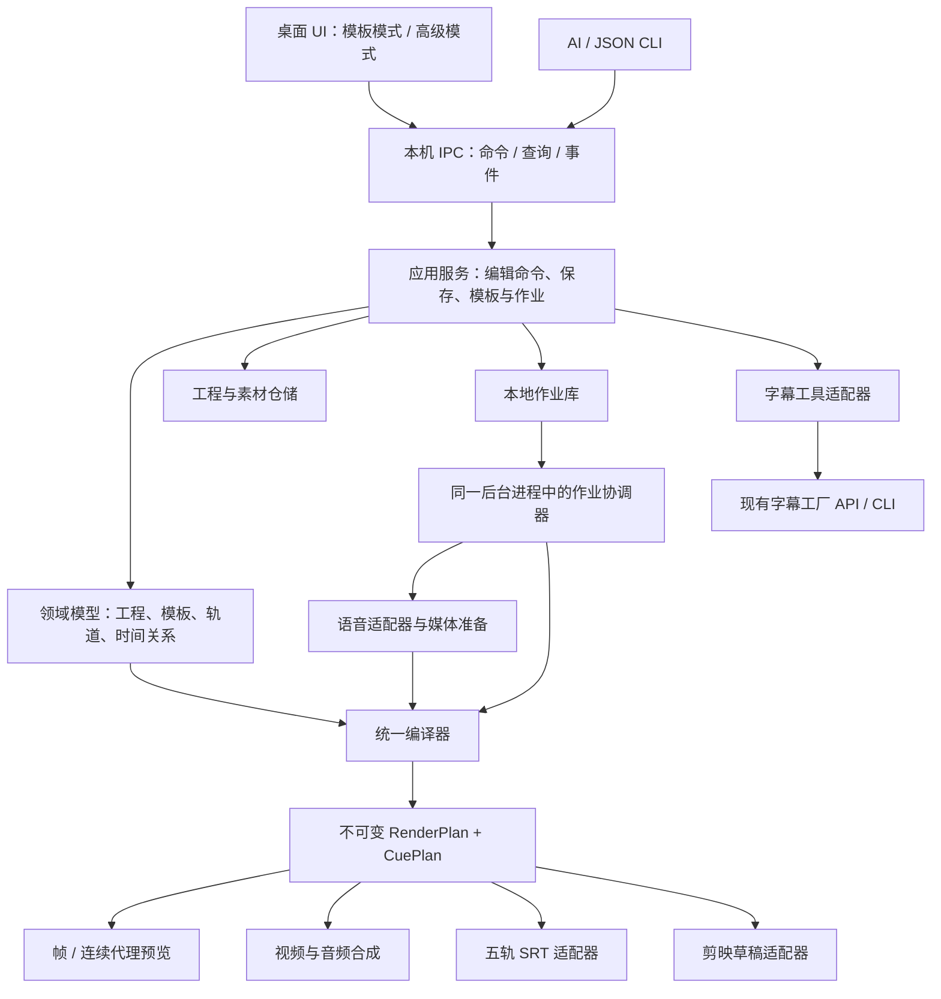

# 视频制作软件顶层架构 v1

2026-09-16｜状态：主控设计基线，供后续开发与放行使用；不是产品已实现或通宵任务已启动的声明。产品中文名待定，开发代号沿用 `word_video_studio`。

## 1. 要达成的产品与当前边界

产品是本地的模板化视频制作工作台。模板作者能独立编辑文字、音频、背景和片头；生产成员套用模板批量出片；每人本机渲染，通过模板包共享。视频制作有模板模式和高级模式，两者编辑同一个工程。目标产物继续包括 MP4、五轨 SRT 和可编辑剪映草稿。

DeepSeek 先完成视频制作。原字幕工厂的桌面、独立字幕业务核心、CLI/API、EXE 与液态玻璃实现均不修改。新软件在第二阶段视频主流程通过后，用适配器接入既有字幕能力。字幕工具按原文字规则计时，视频字幕按实际工程时间轴计时。

本阶段采用**模块化单体、一个本地应用与作业协调进程、受控媒体子进程**。桌面与 CLI 通过本地接口调用同一应用服务，协调进程负责工程写入与作业调度，重型媒体操作交给子进程。共享模板文件，不共享运行中的数据库；不建立中央渲染服务器、账号平台或多人同时编辑同一工程。

## 2. 实际代码基础决定了什么

| 当前文件 | 已有能力 | 接入新系统的处理 |
|---|---|---|
| `word_video/contracts.py` | WordEntry、SpeechAsset、LessonSpec、固定阶段 TimelineManifest | 保留旧契约；它不是通用编辑工程，不继续塞进全部剪辑字段。 |
| `word_video/timing.py` | 三段朗读、真实音频长度兜底、按词分包 | 作为教学规则的参考与旧任务兼容路径；新时间求解集中到独立编译器。 |
| `word_video/tts.py` 等 | 明确配音路由、缓存、速度处理 | 经语音适配器复用；补齐缓存身份、处理链和失败恢复，不复制音色规则。 |
| `word_video/render/mix.py` | 单声道 48k PCM 顺序拼接 | 当前明确拒绝重叠，不能直接承担高级模式；新增多轨混音后端。 |
| `word_video/render/__init__.py` | 全片背景＋片头＋ASS、H.264/H.265 编码 | 保留旧输出路径；新场景使用通用 RenderPlan 适配器，不假定背景唯一且从零铺满。 |
| `word_video/render/ass.py` | 六类固定文字事件、厘秒时间、按 2160 高度换字号 | 作为旧版兼容；新编辑不能把屏幕字号、画布字号和 ASS 字号混用。 |
| `word_video/draft.py` | 可编辑文字/媒体轨、草稿资源打包 | 复用格式知识，重建按 RenderPlan 导出的适配器；随机 ID/时间戳不当作内容差异。 |
| `word_video/jobs.py` | SQLite、文件锁、分包提交、缓存与恢复 | 保留保护语义；旧任务和新作业模型分开版本化，升级到显式依赖步骤与导出状态。 |
| `subtitle_factory_api.py` / CLI | 独立词表与五轨字幕能力 | 固定版本只读接入，不改变旧程序。 |

本次核对的开发运行时为 Python 3.14.0、PyQt 6.10.0 / Qt 6.10.1、pyJianYingDraft 0.3.0、FFmpeg 6.1.1、SQLite 3.50.4。它们是当前开发环境，不等于团队其他电脑已具备。FFmpeg 构建包含 libass、HarfBuzz 和 NVENC 配置；编码可用性仍需本机小样本探测。

## 3. 系统结构与依赖方向



图中箭头表示调用或数据流，不授权反向依赖。严格约束：

1. `domain` 不导入 Qt、FFmpeg、数据库、TTS SDK 或剪映库。
2. UI 不写 SQL，不拼 FFmpeg 命令，不自己计算另一条导出时间轴。
3. CLI 解析命令后调用应用服务，不能拥有独立业务实现。
4. 导出器只消费编译结果，不能重新解析词表、重新分包或自行发起 TTS。
5. 适配器处理外部格式，不能反过来决定工程数据结构。
6. 主题、液态玻璃、窗口动画位于 UI 外壳；不进入视频画面或改变工程语义，除非用户明确添加了对应视频效果。

## 4. 只维护一份创作意图，明确四类数据

| 数据 | 谁写 | 包含什么 | 不包含什么 |
|---|---|---|---|
| **TemplateRevision** | 模板编辑服务 | 图层蓝图、变量绑定、重复单元、时间规则、开放参数、资源依赖 | 具体批次的词表、凭据、正在运行的任务 |
| **ProjectDocument** | 工程应用服务 | 输入快照、模板来源、展开后的可编辑片段规格、时间约束、用户覆盖 | 播放器对象、控件位置、作业运行状态 |
| **SubmissionSnapshot** | 提交服务 | 某工程修订、选区、模板/引擎版本、导出要求、输入资源身份 | 可被后续编辑改变的活动指针 |
| **RenderPlan / CuePlan** | 编译器 | 已解算时间、已确定字体与媒体、图层顺序、音频采样范围、字幕投影 | 未求解绑定、估算音频时长、UI 临时状态 |

另有资产索引和运行数据库，但不能成为第二份工程正文。`project.json` 是工程内容的权威文件；数据库只保存项目索引、作业、步骤、缓存元数据与事件。

模板应用到词表时，生成包含稳定 `record_id` / `template_node_id` 来源的 ClipSpec。工程保存自己的片段规格和绑定，不在每次打开时重新从最新模板覆盖它。后续换模板版本是显式迁移命令，并报告用户覆盖如何处理。

编辑命令只改 ProjectDocument；求解后的时间、代理和波形可缓存，但都可重建。不要同时保存一套可编辑 `clips` 和一套也能单独修改的 `timeline`。

每种文件有独立的 `document_kind` 与 `schema_version`；应用版本、模板内容版本、协议版本不能混用。新 ProjectDocument v1 与旧 TimelineManifest v1 不是同一个格式。迁移先生成新副本并验证，保留旧文件；导入旧任务生成带来源的工程副本，不反向改写旧归档。

## 5. 工程模型足以表达自由剪辑，也保留批量规则

核心对象：

| 对象 | 最小职责 |
|---|---|
| ContentRecord | 原始词条、显示/朗读字段、用户显式覆盖、来源行与稳定 ID |
| AssetRef | 内容哈希、媒体类型、字体/媒体探测结果；路径由资产仓储解析 |
| Track | 类型、顺序、名称、锁定/隐藏/静音及所属片段 |
| ClipSpec | 独立 ID、文字或素材来源、目标时间约束、源入出点、变速、位置/样式、角色绑定 |
| PhaseSpec | 某个词的朗读/显示阶段，以及依赖真实媒体长度的规则 |
| LinkGroup | 显式联动关系；区分选中分组、布局分组、时间联动，不能混成一个布尔值 |
| BatchPlan | 冻结输入顺序、分组、各组的词条 ID 与输出身份；每组独立编译并从零计时 |
| ExportProfile | 目标格式、尺寸、帧率、声音规格及五轨教学语义要求 |

画布上的“图层”对应当前时刻可见的 ClipSpec。拆分得到新片段 ID，记录来源与源入出点；编辑其中一个片段不会意外改另一片段，除非处于明确的共享样式或联动操作。

拆分媒体保留 `record_id`、语义角色与来源关系，但不自动复制完整朗读标记；语义阶段与实际片段区间分别校验。字幕规则必须声明引用“阶段区间”还是“当前片段区间”。拖动导致显示与朗读分离时报告具体关系，不能一边按旧阶段出 SRT、一边在视频使用新时间却仍称一致。

编辑范围分三种：选中片段、当前工程中同角色全部片段、模板默认值。默认只改选中对象。“另存为模板”应检查变量、重复单元与时间关系，不能把一个具体单词的绝对秒数自动冒充通用模板。

所有持续时间、位置和变速输入必须拒绝 NaN、无穷、非法区间与未知字段。未知版本的工程不能被旧程序静默打开再覆盖保存。

## 6. 时间与坐标必须先统一

### 6.1 时间

新工程统一使用整数 `tick`，每秒 720000 tick。首版固定支持 60fps 视频与 48kHz 音频：一帧 12000 tick，一个采样 15 tick。该常量也能精确表示常见整数帧率和 30000/1001 等帧率，但未来开放其他帧率前仍需完整验收。

- 所有片段使用左闭右开 `[start, end)`，禁止含糊的“最后一帧再加一”。
- 视频可见边界在工程帧网格；音频源修剪可在采样网格。媒体源 PTS 与工程时间分开，由时间适配器转换。
- 对自动朗读阶段，按实测 PCM 时长与既定间隔求最小容量，再向上取整到完整视频帧；不得用估算 TTS 时长做最终导出。
- SRT 的毫秒、剪映的微秒只在适配器边界从绝对端点转换。采用正值半入取整，禁止把已取整的小段时长逐段累加；共享端点只转换一次。
- VFR 或异常 PTS 输入必须建立明确映射，或者先生成规范化媒体并保留原媒体；不能把源帧编号直接当工程帧编号。

时间依赖单向流动：**媒体实际时长 → PhaseSpec → ClipSpec**。依赖图必须无环。UI 拖动片段可改绑定偏移或显式改为绝对时间，不能既保留绑定又暗存一个优先级不明的绝对起点。

例如男声阶段由 60 帧变为 84 帧时，绑定其结束的中文阶段自动后移 24 帧；仅修改英文文字的 X 坐标，不改变阶段时长，也不触发重新配音。若用户独立移动一个音频片段，后续片段是否联动由显式操作决定，不向时间依赖图反向回写。

### 6.2 位置、文字与磁吸

画布使用目标视频像素坐标，左上为原点，X 向右、Y 向下。图层存 `x/y`、固定文本框、归一化锚点、`scale_x/scale_y`；字体大小使用画布像素。字号影响排版，图层缩放是排版完成后的独立变换。

`viewport = view_transform(canvas)`；指针操作使用逆变换。Windows DPI、预览缩放、滚动、画面留黑不写进工程。中心磁吸按变换后的选区边界计算，吸附阈值用界面逻辑像素，最终位置写回精确画布坐标；多选按整体包围盒居中。

Qt Graphics View 明确区分 item、scene 与 view 坐标，并提供双向映射；本项目直接使用这种分工，不为每个控件另造一套偏移算法。[Qt Graphics View](https://doc.qt.io/qt-6/graphicsview.html)

## 7. 模板展开与自由编辑怎样共存

模板定义全片单元、重复词条单元、字段绑定、阶段关系、样式和可替换素材。时间表达式使用受限的声明式操作，如固定时长、引用阶段端点、偏移和取最大值；不允许模板携带 Python/JavaScript 或任意表达式执行。

编译顺序固定：

1. 校验格式与输入，保留原文及显式覆盖；选择范围并冻结原始顺序。
2. 展开模板重复单元，产生稳定片段 ID；应用工程覆盖与独立片段。
3. 生成 SpeechPlan，查缓存并准备真实配音；缺配音时只可提供带状态的估计，不生成正式 RenderPlan。
4. 用真实媒体时长求解阶段依赖，确定各片段源范围、目标范围和变速处理链。
5. 排版文字、确定字形与字体，检查长文本/溢出，应用画布变换。
6. 生成 RenderPlan 与语义 CuePlan，逐目标检查能力，最后冻结版本和哈希。

模板模式与高级模式只是应用服务上的两种操作界面。锁定参数服务于防误操作，用户进入高级模式仍能编辑；局部改动不改团队原模板。字体或位置变化只失效布局/画面缓存；朗读文本变化只失效相关语音及其下游时间结果。

批量模式先冻结 BatchPlan，再按组实例化独立工程和计划，每组的片头、配音、字幕与背景从本组零点安排。高级模式手工编辑的单工程默认作为一个完整输出单元；重新分包是显式操作，需重新验证跨边界片段。不能先渲染一个大工程再按词数截视频，以免切断音频或错用全片 SRT 时间。编译器负责规划和求解，TTS、文件下载与媒体转换由协调器调用适配器完成，编译器本身不发外部请求。

自由编辑工程可以保存和预览；“发布为可批量模板”“生成五轨教学字幕”有各自校验。无法投影到五轨语义时定位冲突片段，不能静默丢掉它。若用户明确只导出 MP4，按该目标校验；默认三产物任务不能少一项就宣告完整交付。

## 8. 预览与最终输出采用同一排版与场景计划

### 8.1 首选实现路线

桌面采用现有 PyQt6/Qt Widgets；画布与时间轴使用 Graphics View。新场景的文字由独立 `TextLayoutService` 使用 Qt 字体排版生成布局结果与透明像素缓存，供编辑画布和 FFmpeg 合成共同使用。原字幕/原视频的 ASS 路径保留用于兼容，不作为新工程的唯一时间表达。

Qt 的 QTextLayout 提供低层文字排版与 glyph run 读取，这里只放在文本渲染适配层，领域模型不依赖 Qt。[Qt QTextLayout](https://doc.qt.io/qt-6/qtextlayout.html)

这会让新产品的渲染 worker 使用 Qt 的无窗口文字能力，但 CLI 入口和业务模块不导入 UI，不依赖桌面点击或剪映自动化。原独立字幕 CLI 的无 Qt 契约不改变。团队安装包需携带对应文字渲染与字体依赖，不能依赖开发者的 PyCharm 环境。

**内部透明文字缓存是渲染材料，不是工程正文。** 工程和剪映草稿仍保存可编辑文字、字体、样式；禁止把这些导出成整片截图以绕过可编辑性。

### 8.2 三种预览职责

- **编辑反馈**：暂停在当前时刻，使用分层帧与同一文字表面缓存作拖动、缩放、磁吸反馈。图层命中框覆盖当前有效布局；不在每次鼠标移动时重编码整段视频。
- **准确帧检查**：通过同一 RenderPlan 和合成后端生成指定帧，验证落点、样式和当前修订；用于静态检查，不当作连续播放证据。
- **连续播放**：同一 RenderPlan 生成分段低清代理，交给 QMediaPlayer 播放；字幕与音频已在代理内同步。播放中开始编辑时先暂停，再进入分层反馈，避免旧代理上的文字与新文字叠出双影。

QMediaPlayer 的定位参数是毫秒，媒体载入与错误反馈是异步的，因此它负责播放，精确帧定位由 FrameService 负责；播放器 `setPosition` 不是帧准确承诺。[Qt QMediaPlayer](https://doc.qt.io/qt-6/qmediaplayer.html)

预览请求包含 `project_revision`、`render_plan_hash`、时间范围和规格。过期响应不得替换新预览；缓存键不使用文件 mtime 作为唯一条件。拖动时合并请求、优先最新帧；先生成当前位置附近片段，后台补齐。进入播放前必须确认正在播放对应工程版本，失败不能继续显示“已更新”。

代理片段是缓存单元，播放输入应汇合为连续媒体或连续播放窗口。不能用反复 `setSource` 切小文件冒充无缝播放；片段接缝、音频连续性与跨窗口定位必须实测。若当前播放适配器达不到要求，在 C 验证阶段调整播放后端，不以旧代理或删掉连续播放要求绕过。

### 8.3 视频、音频与草稿

- MP4：RenderPlan 编译为受控 FFmpeg 合成图，处理独立视频源入出点、画布变换、遮挡顺序与文字表面。所有输入 PTS、图像帧率、输出 CFR 和颜色规格由适配器明确指定。控制图很大时按连续片段分段，不按整个 1500 词一次性堆叠数千输入；分段汇合处必须无重复帧/丢帧。
- 音频：新增按采样时间混合的后端，支持独立源修剪、显式速度、音量、静音与多轨重叠。每个处理步骤记录输入哈希，速度不重复应用。自动归一化、限幅不是隐式副作用；导出配置决定增益策略，并检查过载。首版新工程标准化为 48kHz，声道数写入 ExportProfile，旧版 mono 验收保持独立。
- 五轨 SRT：消费显式 CuePlan。默认 01 来自两遍英文阶段，02 来自英文显示，03 音标显示，04 中文显示，05 与中文显示关联的无词性朗读字段；编辑后依据实际语义绑定求投影，不再直接套旧 `male_frame/chinese_frame` 字段。重叠或丢失角色给出具体冲突；SRT 只保存文字与时间。
- 剪映：独立 exporter 将 RenderPlan 映射成可编辑片段。字体排版属于另一渲染器，必须通过位置/字号/字形对照和真实打开编辑验证；共享计划本身不能证明像素一致。不能为了通过验收将所有文字转图。保存后的剪映工程不承诺能无损回导本软件。

首版颜色输出基线固定为 SDR BT.709，输入颜色空间/范围、转换方式及输出标签写入 ExportProfile；文字颜色解释和透明表面的 alpha 约定由合成适配层统一。需用有已知值的色块与半透明文字验证两条合成路径，不能仅设置标签而不转换像素。Windows HDR 或显示器配置不是工程颜色字段；这些显示差异与编码结果分别记录。

FFmpeg 的 ASS/subtitles 使用 libass，字体目录和原始尺寸都会影响结果。旧 ASS 适配器继续封装这些差异，新工程的排版与坐标不能由每个导出器各自猜测。[FFmpeg filters](https://ffmpeg.org/ffmpeg-filters.html)

默认教学模板应保持现有视频 SRT 的具体口径：01 分别覆盖第一遍英文开始至第二遍开始、第二遍开始至中文开始；02 从第一遍英文开始至本词结束；03 从第二遍英文开始至本词结束；04/05 从中文开始至本词结束。它们并非五条互相排斥的画面轨道，也不等同于三条音频的有声长度。此口径来自现有 `word_video/srt_export.py`；自由编辑时在此基础上显式更新 CuePlan 绑定。

## 9. 能力矩阵必须先于功能开关

每个 ExportProfile 声明支持的图层、变换、文本样式、音频处理与语义投影。`check_capabilities(plan, targets)` 返回对象路径与原因，不允许未知功能悄悄失效。

| 用户能力 | 新画面/预览 | 剪映适配 | 五轨 SRT |
|---|---|---|---|
| 字体、字号、颜色、位置、缩放、描边/阴影 | 用同一文字布局与场景计划 | 逐项字段映射与真实编辑验证，尚未通过前不能标已支持 | 样式不适用，文本/时间必须一致 |
| 视频/背景独立移动与修剪 | 源区间、目标区间、遮挡与变换 | 对应视频片段与轨道 | 仅有关字幕时间影响 |
| 多轨音频重叠、剪辑 | 新混音器；旧顺序拼接器不能承担 | 对应音轨与片段 | 需要教学阶段投影可成立 |
| 模板长词/长释义适配 | 显式文本框、换行、缩字下限 | 记录实际排版与映射偏差 | 不得改写或漏字 |

这些是必须完成的适配目标，不是当前已实现清单。首版不设计任意外部特效插件；未来功能沿能力矩阵扩展，不在导出器里静默降级。

## 10. 本地作业系统与运行隔离

本地协调进程持有唯一实例锁，并拥有工程写入、任务入库和状态转换的唯一写入口。UI/CLI 通过本机命名管道提交带 request_id 的版本化 JSON；不传 Python pickle 对象，不开放远程服务。CLI 可启动未运行的协调器；已运行时复用同一实例。进程间只传命令、状态与受管理文件引用，不在命名管道内搬运原始视频帧。

编辑器持有当前修订的只读镜像与拖动中的临时反馈。一次拖动结束形成一条命令，协调器检查 expected_revision、在副本应用并校验，再以同盘临时文件和原子替换保存 project.json；落盘成功才确认并广播新修订。保存失败不能显示“已保存”，CLI 与 UI 同时修改时不能最后写入者静默覆盖。撤销/重做也产生新修订，不倒退版本号；首版撤销历史可限当前编辑会话，重新打开至少恢复最近已提交内容。

应用服务把 SubmissionSnapshot 保存到项目数据区，并以短事务提交本地 SQLite。协调器领取步骤、创建受控媒体子进程；UI 关闭后默认保留已提交任务继续运行，退出时显示该行为。主动停止后台时按作业控制协议收尾，渲染不能依靠 UI 对象存活。首次打包验证同时检查后台的启动、发现、退出与崩溃重启，不能只验证主窗口能打开。


步骤有独立状态：pending、running、succeeded、failed、cancelled；作业状态为 queued、running、pause_requested、paused、cancel_requested、cancelled、succeeded、partial_failed、failed。preparing/rendering/verifying/publishing 属于独立的 phase 字段，不与成功失败状态混用。暂停/取消先记请求，进程停稳或达到检查点后再确认，不把“请求已提交”显示成“已暂停”。

三项输出都通过后才发布完整批次。每次尝试使用独立暂存目录，先写文件与校验，再发布清单；同磁盘通过不覆盖的提交方式发布，跨磁盘先写目标暂存、校验后提交。崩溃在文件发布与 DB 更新之间时，以完整清单和哈希恢复对账，不能盲信其中一方。

重试同一 `idempotency_key` 且相同输入返回原任务；内容变更必须报冲突或创建新请求。失败只重跑未完成或缓存失效的依赖步骤。语音路由超时发生在服务已接受之后时，外部服务未必支持“恰好一次”；应保留请求身份与结果并尽力查回，不能承诺绝无重复计费。

调度先限制为一条 GPU 最终渲染作业，语音并发沿已验证限制，预览请求高优先级且合并。更多并发由基准测试决定。协调器持有媒体子进程归属，Windows 上采用受控进程组/Job Object 管理取消与崩溃清理；绝不按进程名结束用户的其他 FFmpeg 或剪映。

数据库首版选择 rollback journal 与短事务，按新调度模型另做并发和恢复验收，不直接切换为 WAL。当前 SQLite 为 3.50.4；官方说明某些并发 WAL 写入/检查点组合有已修复问题，启用 WAL 前应先验证运行时与并发模型。团队只交换模板包，不把活动 DB 放共享盘或同步目录。[SQLite WAL](https://www.sqlite.org/wal.html)

## 11. 素材、字体、缓存与可移植模板

AssetRef 使用内容哈希及类型，路径放在独立 locator。提交任务时把需要固定的输入纳入受管理资产区；仅记录外部路径的模式必须在使用前重验并明确可能报 INPUT_CHANGED。不能把指向用户可修改文件的硬链接当成不可变快照。

缓存按依赖分层：原始语音键包括派生朗读文本及清洗版本、路由/模型/资源、角色/音色和服务参数；加工语音键再加原始音频哈希、源范围、速度、采样与处理器版本；文字布局键包括真实字体文件哈希/face、文字、布局与样式；帧/代理键包括 RenderPlan 哈希、范围和质量。GPU/CPU 编码路径影响编码产物键，不能把跨编码器字节差异当损坏。

模板包含 manifest、版本、图层/绑定定义、可分发资源、字体依赖、缩略图与示例；不含凭据、机器绝对路径或代码。导入先写暂存区，核对文件哈希、大小/数量、相对路径和版本，再发布到模板库。同 ID 同版本不同内容是冲突，不能覆盖旧版本。对实际解压大小执行限制，而非只信 ZIP 声明。

运行数据根与程序分开，默认选有足够空间的本地目录；使用者可以配置。工程/模板/活动作业引用的资产有保留标记，缓存清理只处理可再生且未被使用的项，不删归档。导入模板预检缺字体/素材与音色可用性，不悄悄改变团队模板效果。

程序包锁定 Python、Qt、媒体工具与复用后端版本，资源通过安装包或配置的资产根发现。新旧适配器不能依赖开发机的 PYTHONPATH、PyCharm 工作目录或硬编码的 C 盘项目路径。小样本构建应尽早在隔离目录启动 CLI、后台与界面；这属于可部署性验证，另一台电脑的完整验收仍单独执行。

## 12. 接口与模块所有权

开发目录规划如下；本次未创建代码仓库或移动旧项目。

```text
word_video_studio/
  src/word_video_studio/
    domain/          # 工程、模板、片段、时间、语义角色；纯 Python
    application/     # 编辑命令、修订、撤销、模板展开、提交与查询
    compiler/        # 时间求解、排版请求、RenderPlan/CuePlan
    ports/           # 媒体、文字布局、仓储、语音、导出接口
    adapters/        # FFmpeg、Qt text、剪映、旧字幕、旧视频接口
    infrastructure/  # 文件仓储、SQLite、进程、缓存、发布
    ui/              # 画布、时间轴、属性面板、模板与任务视图
    cli/             # JSON 协议与参数解析
    worker/          # 作业协调与受控执行
  tests/             # 领域/接口、故障注入、渲染与端到端
  docs/adr/          # 架构决策及变更依据
```

| 应用接口 | 主要约束 |
|---|---|
| `project.apply(project_id, expected_revision, commands)` | 同一个编辑入口供 UI/CLI 使用；修订冲突拒绝；一组拖动合并成可撤销命令。 |
| `template.instantiate(template_ref, records, parameters)` | 固定模板版本；输出可编辑工程，不直接输出 MP4。 |
| `project.validate(revision, targets)` | 返回分层问题与对象路径；缺媒体可区分待准备和不可用。 |
| `preview.request(revision, range, quality)` | 请求可取消，响应带版本；旧结果不能覆盖新请求。 |
| `job.submit(snapshot, idempotency_key)` | 接受快照，之后用户修改工程不影响此任务。 |
| `job.control(job_id, action)` | 只控制归属本作业的执行；状态转换幂等。 |
| `job.events(job_id, after_seq, limit)` | 增量事件单 JSON，供 UI 与 Agent 查询；序列单调，支持续读。 |
| `subtitle_tool.execute(request_v1)` | 适配现有字幕入口，不重新实现旧计时规则。 |

协议有单独版本；成功/失败都返回一个 UTF-8 JSON，错误包含 code、message、object_path、可行处理方式。命令注册表同时生成 schema 和帮助，避免“实际 13 个命令、schema 只列 11 个”的漂移。

主控维护 domain/ports/schema 及能力矩阵。实现者按接口分工：编辑器、媒体/渲染、模板/队列、剪映/字幕适配可独立开发，但不能并行修改同一契约。新增跨模块字段先改契约、迁移与验证例，再改消费者；没有证据不能自己扩大支持状态。此处定义分工，不自动派发额外 Agent。

## 13. 三个必须先做的架构验证

| 验证 | 目的与放行证据 | 当前状态 |
|---|---|---|
| A：文字、时间与坐标 | 同一布局用于画布/视频；60fps 边界正确；中英音标、颜色、缩放、阴影与 DPI 均需验证 | 本轮仅完成无窗口文字 RGBA 及五帧合成小探针；其余待开发验证。 |
| B：自由剪辑与三产物 | 小工程包含独立移动、源修剪、音频重叠；导出 MP4、语义 SRT、可编辑剪映；实际打开修改重开 | 尚未执行。 |
| C：预览、队列和恢复 | 连续播放、快速修改只显示最新版本；UI/CLI 修订冲突；暂停/取消、worker 崩溃、完成后重试；候选包独立启动；界面不被重活阻塞 | 尚未执行。 |

本轮 A 的小探针：Qt 无窗口生成透明文字面，随后 FFmpeg 合成五帧，要求文字只出现于零基第 1、2 帧。首次省略图像输入帧率与输出 CFR 限定，实际多出第 3 帧；明确图像输入 60fps、输出 60fps CFR 后，出现帧准确为 `[1, 2]`。同一字体表面含 1462 个部分透明边缘像素。它证明局部机制可用，不证明编辑器流畅、字体全面正确、剪映一致或所有视频都帧准确。证据位于 `视频制作架构_20260916/probes/`。

这三个验证要在大规模铺界面前解决，允许使用手写的小工程与最小测试窗口，不要求先造完整编辑器。发现 Qt 播放或剪映映射不满足要求时，调整对应适配器，不让领域模型跟着播放器或草稿内部格式重写。

## 14. 分阶段实施与主控放行

| 阶段 | 必交结果 | 放行条件 |
|---|---|---|
| M0 视频生产与验收修复 | 修判卷漏洞、默认离线测试、七包只读复验、三词片头分支回归、草稿实操证据 | 已知坏样本能失败；新生成小样本通过；未验证项明确。不得只报测试数。 |
| M1-A 架构骨架与关键验证 | schema/命令/时间模型、A/B/C 小闭环、旧数据适配、最早可启动候选包 | 数据能保存重开；媒体路径可行；核心支持矩阵有实际证据。 |
| M1-B 高级编辑 | 独立轨道、拖动修剪拆分、文字属性、磁吸、撤销、持续预览 | 连续真实操作，编辑后再次打开与导出一致。 |
| M1-C 模板与团队批量 | 模板发布/导入、字段与时间绑定、局部覆盖、任务队列 | 长短内容泛化、三词再五十词、恢复与幂等、不同目录模板导入。 |
| M1-D 字幕集成与交付 | 只读适配旧字幕工具、完整安装包、文档与状态清单 | 旧字幕结果兼容；包内不依赖开发路径；新机器验收单独标明是否完成。 |

整晚任务允许主控验收后连续进入下一阶段。`gate_result.json` 记录对应代码/契约版本、用例、真实证据路径、结果、未完成项与主控裁定；不能用无依据的 PASS 布尔值解锁。未验证的剪映真实编辑不能写为已通过。若仅物理验收暂不可做，可继续不依赖它的领域/UI 验证，但不得将整体阶段改称通过或完成对外交付。

验收包含：独立原始输入/用户编辑期望、全部字幕角色与媒体区间、单帧精确边界、完整连续播放、任务恢复、旧入口兼容。机器检查不证明人的视听感受；截图也不证明连续动画已检查。先保存旧证据，修有错的测试时保留失败复现，不冻结错误假设。

性能先定测量对象：50 词工程、至少 150 条语音片段、三类词条文字和背景；窗口中只创建可见时间轴图元，波形按分辨率缓存，不随每次拖动遍历全片。工程目标为拖动反馈 P95 < 33ms、长任务异步且状态可见、十分钟连续代理播放无持续漂移；这些是待测目标，不是当前实测结果。渲染吞吐、峰值内存和代理构建延迟先量基线再设约束，不把五帧小探针耗时外推到整片。

## 15. 需要一直遵守的决策

- 产品名可以晚定；数据格式、时间、坐标、编辑命令与版本关系先定。
- 保留旧管线作为兼容路径，用新工程和适配层承接自由编辑；不让 UI 成为业务数据库。
- 单一 RenderPlan 是一致性的必要条件，仍需同一排版、明确转换与跨导出实际验证。
- 不把 QMediaPlayer 当剪辑引擎，不把剪映 JSON 当工程格式，不把模板当一张截图。
- 不让一次换字体重新调用全部 TTS，不让后台任务追随用户正在修改的工程。
- 默认模板包可移植，活动队列和凭据留在各自电脑。
- 本阶段不改原字幕工厂；适配器是边界，字幕生成按原契约验证。

此文负责顶层架构，第二阶段产品约定负责用户交互，命名规范负责术语，执行任务书负责当前实施批次。后续变更必须记录原因、受影响契约、迁移和验证证据。旧阶段汇报保留历史事实，不替代现场状态。
